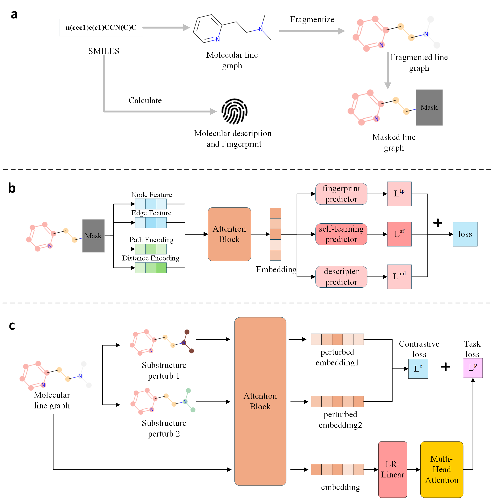

# SubMCL
## About
This repository contains the code and resources of the following paper:

A Knowledge-Guided Pre-training Framework for Improving Molecular Representation Learning

## Overview of the framework
SubMCL is a novel self-supervised learning framework for the representation learning of molecular graphs, consisting of a novel graph transformer architecture, SubMCL, and a knowledge-guided pre-training strategy.

 

## **Setup environment**

Setup the required environment using `environment.yml` with Anaconda. While in the project directory run:

    conda env create

Activate the environment

    conda activate SubMCL

## **Pretrain**

Preprocess unlabeled SMILES in pretrain dataset

    python preprocess_pretrain_dataset.py --data_path ../datasets/pretrain/

DistributedDataParallel pretrain SubMCL

    CUDA_VISIBLE_DEVICES=0,1,2,3 python -u -m torch.distributed.run --nproc_per_node=4 --nnodes=1 --master_port 12312 train_submcl.py --save_path ../models/pretrained/base/ --n_threads 8 --n_devices 4 --config base --n_steps 100000 --data_path ../datasets/pretrain/

## **Finetune**

Preprocess downstream datasets, extracting molecular descriptors and the fingerprints

    python preprocess_downstream_dataset.py --data_path <DATA_PATH> --dataset <DATASET_NAME>

Finetune pretrained model on downstream tasks

    python finetune.py \
      --config <CONFIG_NAME> \
      --model_path <PRETRAINED_MODEL_PATH> \
      --dataset <DATASET_NAME> \
      --data_path <DATASETS_ROOT_PATH> \
      --dataset_type <DATASET_TYPE> \
      --metric <EVAL_METRIC> \
      --split <SPLIT_STRATEGY> \
      --weight_decay <WEIGHT_DECAY_VALUE> \
      --dropout <DROPOUT_RATE> \
      --lr <LEARNING_RATE>

example:

    python finetune.py --config base --model_path ../models/pretrained/base.pth  --dataset bace --data_path ../datasets/ --dataset_type classification --metric rocauc --split scaffold-0 --weight_decay 0 --dropout 0 --lr 3e-5
